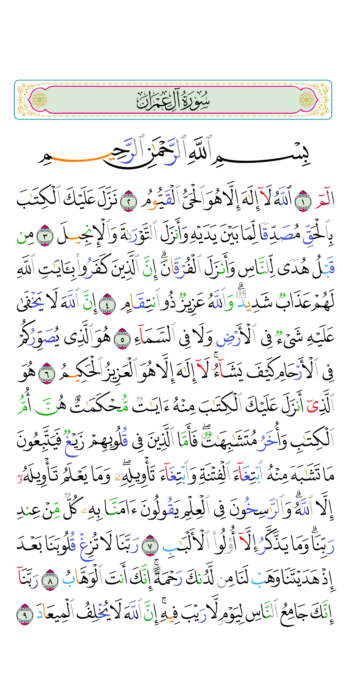
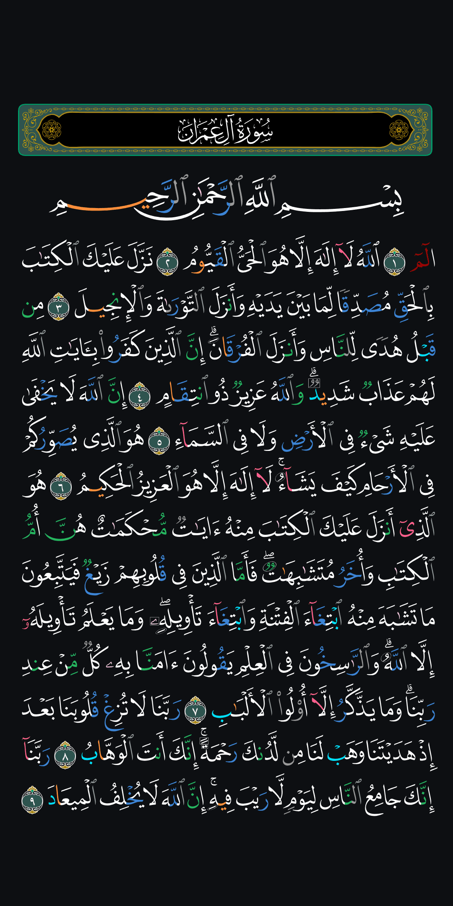

# Mushaf Tajweed CDN · Sakina

Colour-coded Tajweed Mushaf pages (KFGQPC V4, Madani layout, 604 pages) as ready-to-use PNG images — in **light** and **dark** themes — served straight from GitHub.

Страницы цветного мусҳафа Таҷвид (KFGQPC V4, мадинская разметка, 604 страницы) в виде готовых PNG — в **светлой** и **тёмной** теме — с раздачей прямо с GitHub.

| Light · Светлая | Dark · Тёмная |
| :---: | :---: |
|  |  |

**Languages:** [English](#english) · [Русский](#русский)

> Need the plain Mushaf, without tajweed colours? → [SakinaDevGroup/mushaf-madani-cdn](https://github.com/SakinaDevGroup/mushaf-madani-cdn) — the same pages, same size and URL scheme, black on white and white on dark.

---

## English

### What is inside

```
light/p1.png … light/p604.png   white page, tajweed colours
dark/p1.png  … dark/p604.png    dark page (#0D0F12), white letters, tajweed colours
tools/render_pages.py           the script that produced every image
```

| Property | Value |
| --- | --- |
| Pages | 604 (standard Madani 15-line layout, Hafs 'an 'Asim) |
| Size | 1080 × 2160 px — the same sheet for every page |
| Format | PNG, 8-bit indexed palette (lossless for this artwork), ≈ 190 KB per page (≈ 115 MB per theme) |
| Light theme | background `#FFFFFF`, font palette 0 |
| Dark theme | background `#0D0F12`, font palette 1 |

Every page sits on a sheet of the **same size and scale**. Short pages (1, 2 — Al-Fatiha and the start of Al-Baqarah) and pages with several surah headers (601–604) are centred on it, so the script never changes size between pages. Show the image with `fit: width` and the page background colour of its theme, and the sheet edges are invisible.

### URLs

```
https://raw.githubusercontent.com/SakinaDevGroup/mushaf-tajweed-cdn/main/{theme}/p{page}.png
https://cdn.jsdelivr.net/gh/SakinaDevGroup/mushaf-tajweed-cdn@main/{theme}/p{page}.png   (CDN mirror)
```

`{theme}` is `light` or `dark`, `{page}` is `1`–`604` without leading zeros.

### Using it in an app (Flutter / Dart)

```dart
const _base = 'https://raw.githubusercontent.com/SakinaDevGroup/mushaf-tajweed-cdn/main';
const _mirror = 'https://cdn.jsdelivr.net/gh/SakinaDevGroup/mushaf-tajweed-cdn@main';

/// Primary URL first, the CDN mirror as a fallback.
List<String> tajweedPageUrls(int page, {bool dark = false}) {
  final theme = dark ? 'dark' : 'light';
  return ['$_base/$theme/p$page.png', '$_mirror/$theme/p$page.png'];
}
```

Recommendations:

- **Cache pages on the device** after the first download (the whole Mushaf is ≈ 115 MB per theme) — do not fetch the same page twice.
- Try the mirror when the primary URL fails; treat a response smaller than ~5 KB as an error.
- Keep the 1 : 2 sheet: display with `BoxFit.fitWidth` inside `AspectRatio(aspectRatio: 1 / 2)` on the theme background.

### Regenerating the pages

The images are rendered by the same HTML engine the Sakina app uses to show the Mushaf (`KFGQPC_V4_layout`: `index.html`, 604 per-page COLR/CPAL colour fonts and `script/quran_pages.json`), opened in headless Chrome:

```bash
python -m pip install playwright pillow
python tools/render_pages.py --engine path/to/KFGQPC_V4_layout            # all pages, both themes
python tools/render_pages.py --engine path/to/KFGQPC_V4_layout --themes dark --pages 1-10
```

Light and dark are simply two palettes of the same colour fonts, applied to the ayah lines, the basmala and the surah headers alike — so every non-tajweed letter is black on the light page and white on the dark one.

### Sources and credits

- **Script and fonts:** KFGQPC V4 Tajweed colour fonts by the *King Fahd Glorious Qur'an Printing Complex* (Madinah), as published through the [Quranic Universal Library (QUL)](https://qul.tarteel.ai/) — used under their terms of use.
- **Page layout and render engine:** [SakinaDevGroup/KFGQPC_V4_tajweed](https://github.com/SakinaDevGroup/KFGQPC_V4_tajweed), a fork of [IsmailHosenIsmailJames/al_quran_mushaf](https://github.com/IsmailHosenIsmailJames/al_quran_mushaf).
- **Images:** rendered by SakinaDevGroup for the Sakina app.

The Qur'anic text is not modified. If you find an error on any page, please [open an issue](../../issues) with the page number.

---

## Русский

### Что внутри

```
light/p1.png … light/p604.png   белая страница, цвета таҷвида
dark/p1.png  … dark/p604.png    тёмная страница (#0D0F12), белые буквы, цвета таҷвида
tools/render_pages.py           скрипт, которым сделаны все картинки
```

| Параметр | Значение |
| --- | --- |
| Страниц | 604 (стандартная мадинская разметка, 15 строк, риваят Хафс от Асыма) |
| Размер | 1080 × 2160 px — один и тот же лист для каждой страницы |
| Формат | PNG, 8-битная палитра (без потерь для этих изображений), ≈ 190 КБ на страницу (≈ 115 МБ на тему) |
| Светлая тема | фон `#FFFFFF`, палитра шрифта 0 |
| Тёмная тема | фон `#0D0F12`, палитра шрифта 1 |

Все страницы лежат на листе **одного размера и масштаба**. Короткие страницы (1, 2 — Фатиха и начало Бакары) и страницы с несколькими заголовками сур (601–604) стоят по центру листа, поэтому размер букв не прыгает от страницы к странице. Показывайте картинку по ширине на фоне цвета её темы — края листа не видны.

### Ссылки

```
https://raw.githubusercontent.com/SakinaDevGroup/mushaf-tajweed-cdn/main/{theme}/p{page}.png
https://cdn.jsdelivr.net/gh/SakinaDevGroup/mushaf-tajweed-cdn@main/{theme}/p{page}.png   (зеркало CDN)
```

`{theme}` — `light` или `dark`, `{page}` — от `1` до `604`, без ведущих нулей.

### Как подключить в приложение (Flutter / Dart)

```dart
const _base = 'https://raw.githubusercontent.com/SakinaDevGroup/mushaf-tajweed-cdn/main';
const _mirror = 'https://cdn.jsdelivr.net/gh/SakinaDevGroup/mushaf-tajweed-cdn@main';

/// Сначала основной адрес, зеркало CDN — запасной.
List<String> tajweedPageUrls(int page, {bool dark = false}) {
  final theme = dark ? 'dark' : 'light';
  return ['$_base/$theme/p$page.png', '$_mirror/$theme/p$page.png'];
}
```

Рекомендации:

- **Сохраняйте страницы на устройстве** после первой загрузки (весь мусҳаф ≈ 115 МБ на тему) — не скачивайте одну страницу дважды.
- Если основной адрес не ответил, пробуйте зеркало; ответ меньше ~5 КБ считайте ошибкой.
- Сохраняйте лист 1 : 2: показывайте через `BoxFit.fitWidth` внутри `AspectRatio(aspectRatio: 1 / 2)` на фоне цвета темы.

### Как пересобрать страницы

Картинки нарисованы тем же HTML-движком, которым приложение Sakina показывает мусҳаф (`KFGQPC_V4_layout`: `index.html`, 604 цветных шрифта COLR/CPAL по одному на страницу и `script/quran_pages.json`), открытым в безголовом Chrome:

```bash
python -m pip install playwright pillow
python tools/render_pages.py --engine путь/к/KFGQPC_V4_layout            # все страницы, обе темы
python tools/render_pages.py --engine путь/к/KFGQPC_V4_layout --themes dark --pages 1-10
```

Светлая и тёмная темы — это просто две палитры одних и тех же цветных шрифтов. Палитра применяется и к строкам аятов, и к басмале, и к заголовкам сур, поэтому все буквы без правил таҷвида на светлой странице чёрные, а на тёмной — белые.

### Источники и благодарности

- **Письмо и шрифты:** цветные шрифты KFGQPC V4 Tajweed *Комплекса короля Фахда по изданию Священного Корана* (Медина), опубликованные через [Quranic Universal Library (QUL)](https://qul.tarteel.ai/), — используются на их условиях.
- **Разметка страниц и движок рендера:** [SakinaDevGroup/KFGQPC_V4_tajweed](https://github.com/SakinaDevGroup/KFGQPC_V4_tajweed) — форк [IsmailHosenIsmailJames/al_quran_mushaf](https://github.com/IsmailHosenIsmailJames/al_quran_mushaf).
- **Картинки:** отрисованы SakinaDevGroup для приложения Sakina.

Текст Корана не изменён. Если нашли ошибку на какой-либо странице, [создайте issue](../../issues) с номером страницы.
